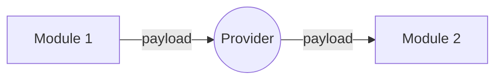
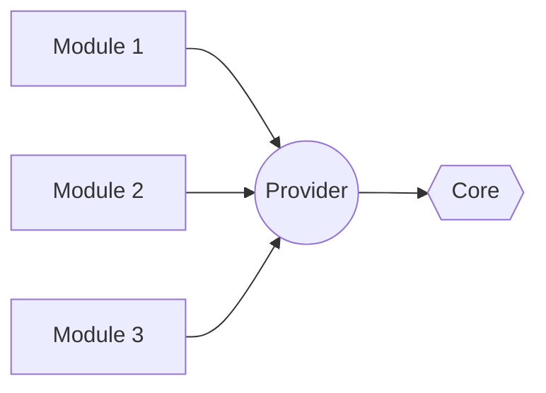

# Welcome to My Architecture Design!

Orang - orang bertanya seberapa rumit seharusnya arsitektur dari sebuah software? Kenapa rumit
sekali? Bisakah ini menjadi lebih mudah? Dependensi berputar, tidak memungkinkan untuk dilakukan.
Runtime yang kacau dan tidak bisa di prediksi. Dimana kita bisa menghentikan sumbu yang terbakar
sebelum meledak?

Well orang bilang, tidak ada arsitektur yang sempurna. Saya cukup setuju, tetapi apa definisi
sempurna itu? Atau minimal bagaimanakah arsitektur yang baik itu?

Untuk bisa tau seberapa baik sebuah arsitektur, kita membutuhkan sebuah alat untuk mengukurnya. 
Alat tersebut adalah "Alur dependensi" dan "Alur kerja".
Ya, arsitektur adalah tentang Flow Dependensi dan Flow Runtime. Hal-hal selain itu adalah preferensi saja.

Disini kita akan "Back to Basic" dengan konsern sepenuhnya pada Flow dependensi dan Flow runtime.

Saya memiliki prinsib sederhana; "Jika
rumit berarti itu salah". Secara naluri, manusia juga pasti akan berfikir seperti itu. Jadi kita
akan membuatnya sedikit lebih mudah dengan menghadirkan sebuah module baru pada gradle project ,
yaitu : **Provider** dan **Injector**

# Project Arsitektur

Projek arsitektur mencakup keseluruhan arsitektur dari gradle project kita. Tidak segala hal bisa
kita lakukan dengan gradle project akan tetapi **Pengecualian adalah hal yang buruk** jika kita
tidak membatasinya. Jadi kita akan membatasi pengecualian tersebut hanya 2 hal.

1. App Module adalah bagian dari Injector. Sehingga App Module dapat berperilaku seperti Injector
   module, akan tetapi tidak boleh memprovide Module apapun sebagaimana module Injector.
2. Straight dependensi ke Core Module.

**Circular dependensi** terjadi dikarenakan kita mengijinkan "Horizontal Dependency" . Jadi kita
akan tidak akan mengijinkan adanya Horizontal dependensi pada module ini.

1. Sebuah module tidak boleh depend ke module lain kecuali Provider.
2. Sebuah module, tidak perlu mengetahui keberadaan Module Lain, selain keberadaan module Provider.

## Provider

Sebagai mana namanya, provider bertugas untuk memprovide module berdasarkan kontrak module pada
provider. Sebagai contoh, module tersebut bisa sebuah **API**, **Aktivitas**, **Widget** dan lain
sebagainya.

### Runtime Flow

Setiap module bisa memanggil module lain melalui kontrak yang sudah dideklarasikan di dalam
Provider. Selanjutnya, **Injector** akan memprovide module berdasarkan kontrak yang di inginkan,
dan **Module 1** tidak perlu tau dari mana dia mendapatkan **Module 2** tersebut. Tentusaja sebuah
module harus memprovide atau meng-injeksikan module tersebut ke **Injector** sebelumnya, untuk
kemudian module tersebut dapat ditemukan oleh **Injector**.

### Dependency Flow

Seluruh module (yang masuk dalam kategori runtime module) hanya depend ke 1 Module, yakni Provider
Module. Sementara Provider Module depend ke **Core Module**. Dalam arsitektur ini **Core Module**
adalah sebuah pengecualian, dikarenakan Core Module memiliki sangat banyak komponent dan kebanyakan
berukuran sangat kecil. Oleh Karena itu, akan jauh lebih mudah jika semua module yang membutuhkan
core **"Straight Depend" ke Module Core**, dan semua module tetap harus **mengakses Core Module
melalui Provider**.

## Igniter

Sebagaimana namanya, igniter adalah sebuah module yang bertugas untuk menjadi sumbu api. Igniter
perlu depend ke semua module, dan **meng-injeksikan** Module-module, API, Widget dll, yang diprovide
setiap Module.

**Application** perlu **diprovide oleh Injector**. Dan injector perlu memprovide seluruh Module ke
Application class.

## Overview arsitektur

Anda bisa melihat overview arsitektur pada file arsitektur-overview.pdf

# Internal Module Arsitektur

Kita mengenal MVVM , Clean Architectur, tapi apakah aplikasi front-end perlu se rumit itu? Menurut
saya, Tidak.

Sebagai front-end developer, saya tidak pernah menemukan kemungkinan yang begitu rumit.

Aplikasi front-end hanyalah 2 hal yakni **UI** dan **Data**. Seberapa rumitkah itu.

## UI

UI adalah module level tinggi, penuh dengan side-effect, lifecycle, configuration changes dan lain
sebagainya. Module ini memang cukup rumit, oleh karena itu, prinsib SOLID dan Dependency injection
akan sangat membantu kita. Tidak ada hal yang istimewa yang perlu saya sampaikan, gunakan ViewModel
dan Injector seperti Koin atau Dagger.

## Data

Disini bagian menariknya. Data layer tidak memerlukan side-effect, tidak perlu memperdulikan
lifecycle dan configuration changes (rotasi, dark mode, dll). Module ini sangat sederhana, jadi
kenapa kita tidak membuatnya menjadi sederhana?

Dalam contoh dalam project ini. Data module tidak perlu mematuhi SOLID principle. Akan tetapi kita
akan memaksimalkan **Functional Pattern** sebisa mungkin. Saya masih menemukan beberapa kesulitan
dalam hal support teknologi, dan dokumentasi, akan tetapi, lihat seberapa sederhana itu.

1. Data module, tidak boleh memiliki state, dia hanya peduli dengan apa data yang diminta, dan
   memberikannya atau memberikan Error / Exception / Either.left apapun yang kalian gunakan.
2. Data module hanya memprovide data dari Source, memberikan data atau Error jika data tidak
   ditemukan. Sedangkan bagaimana source berperilaku bukanlah konsern dari Data module.
3. Repository -> source. Tidak rumit bukan. Dengan monoid chain hal ini dapat menjadi sangat
   sederhana, hanya memerlukan 2 step saja.
